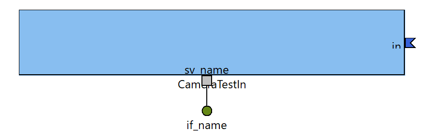
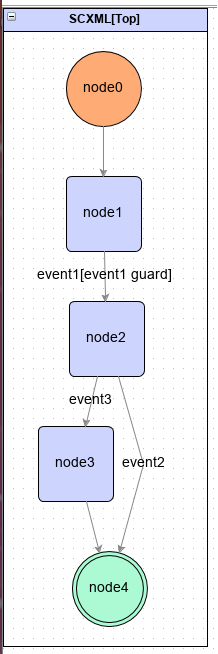

# (基本タブ->モジュール名)

## Overview

(基本タブ->モジュール概要)

## Description

(ドキュメント生成タブ->概要説明)

### Input and Output

(ドキュメント生成タブ->入出力)

### Algorithm etc

(ドキュメント生成タブ->アルゴリズム等)

### Basic Information

<!-- ここにRTCの画像を表示-->
<!-- Build Viewの画像をRTC Builderで出力する。画像ファイル名を上記のように入力-->

|  |  |
----|---- 
| Module Name | (基本タブ->モジュール名) |
| Description | (基本タブ->モジュール概要) |
| Version | (基本タブ->バージョン) |
| Vendor | (基本タブ->ベンダ名) |
| Category | (基本タブ->モジュールカテゴリ) |
| Comp. Type | (基本タブ->コンポーネント型) |
| Act. Type | (基本タブ->アクティビティ型) |
| Kind | (基本タブ->コンポーネント種類) |
| MAX Inst. | (基本タブ->最大インスタンス数) |

### Activity definition

<!-- アクティビティ一覧を表にする -->
<table>
  <!-- 有効にしたアクティビティと、無効のアクティビティで記述内容が違う-->
  <!-- 以下は有効にしたアクティビティの例。implementedと記述して説明を記述する。 -->
  <tr>
    <td rowspan="4">on_initialize</td>
    <td colspan="2">implemented</td>
    <tr>
      <td>Description</td>
      <td>(アクティビティタブ->動作概要)</td>
    </tr>
    <tr>
      <td>PreCondition</td>
      <td>(アクティビティタブ->事前条件)</td>
    </tr>
    <tr>
      <td>PostCondition</td>
      <td>(アクティビティタブ->事後条件)</td>
    </tr>
  </tr>
  <!-- 以下は無効のアクティビティの例。何も記述しない。 -->
  <tr>
    <td>on_finalize</td>
    <td colspan="2"></td>
  </tr>
</table>

### EventPorts definition
<!-- FSNのチェックボックスがオフの場合は何も記述しない-->

|  |  |
----|---- 
| Port Name | (基本タブ->モジュール名) |
| FSM Type | (StaticFSM or DynamicFSM) |

<!-- Eventの一覧を記述する -->
#### Event lists

##### (FSMタブ->イベントリスト->イベント名)

(FSMタブ->イベントリスト->概要説明)

<table>
  <tr>
    <td>Source State</td>
    <td colspan="2">(FSMタブ->イベントリスト->遷移元)</td>
  </tr>
  <tr>
    <td>Target State</td>
    <td colspan="2">(FSMタブ->イベントリスト->遷移先)</td>
  </tr>
  <tr>
    <td>DataType</td>
    <td>(FSMタブ->イベントリスト->データ型)</td>
    <td>(FSMタブ->イベントリスト->データ型(Documentation))</td>
  </tr>
  <tr>
    <td>Number of Data</td>
    <td colspan="2">(FSMタブ->イベントリスト->データ型)</td>
  </tr>
  <tr>
    <td>Unit</td>
    <td colspan="2">(FSMタブ->イベントリスト->単位)</td>
  </tr>
  <tr>
    <td>Operational frecency Period</td>
    <td colspan="2">(FSMタブ->イベントリスト->処理頻度、周期)</td>
  </tr>
</table>

(FSMタブ->イベントリスト->詳細説明)

### InPorts definition

<!-- InPortの一覧を表で記述する -->
#### (データポートタブ->ポート名)

(データポートタブ->概要説明)

<table>
  <tr>
    <td>DataType</td>
    <td>(データポートタブ->データ型)</td>
    <td>(データポートタブ->データ型(Documentation))</td>
  </tr>
  <!-- IDLファイルはファイル名のみを記述し途中のパスは省略する。 -->
  <tr>
    <td>IDL file</td>
    <td colspan="2">(データポートタブ->IDLファイル)</td>
  </tr>
  <tr>
    <td>Number of Data</td>
    <td colspan="2">(データポートタブ->データ型)</td>
  </tr>
  <!-- 「意味」の項目には何を書けばいいのかよく分からない -->
  <tr>
    <td>Semantics</td>
    <td colspan="2">(データポートタブ->意味)</td>
  </tr>
  <tr>
    <td>Unit</td>
    <td colspan="2">(データポートタブ->単位)</td>
  </tr>
  <tr>
    <td>Occirrence frecency Period</td>
    <td colspan="2">(データポートタブ->発生頻度、周期)</td>
  </tr>
  <tr>
    <td>Operational frecency Period</td>
    <td colspan="2">(データポートタブ->処理頻度、周期)</td>
  </tr>
</table>

### OutPorts definition

<!-- OutPortの一覧を表で記述する -->
<!-- InPortと同じのため省略 -->

### Service Port definition

<!-- ServicePortの一覧を表で記述する -->
#### (サービスポートタブ->ポート名)

(サービスポートタブ->概要説明)

<table>
  <tr>
    <td>I/F Description</td>
    <td colspan="2">(サービスポートタブ->I/F概要説明)</td>
  </tr>
  <tr>
    <td colspan="3">Interface</td>
  </tr>
  <tr>
    <td rowspan="9">(サービスポートタブ->インターフェース名)</td>
    <td>Type</td>
    <td>(サービスポートタブ->インターフェース型)</td>
    <tr>
      <td>Direction</td>
      <td>(サービスポートタブ->方向)</td>
    </tr>
    <tr>
      <td>Description</td>
      <td>(サービスポートタブ->概要説明(インターフェース))</td>
    </tr>
    <!-- IDLファイルはファイル名のみを記述し途中のパスは省略する。 -->
    <tr>
      <td>IDL file</td>
      <td>(サービスポートタブ->IDLファイル)</td>
    </tr>
    <!-- 「引数」、「戻り値」、「例外」、「事前条件」、「事後条件」をどう書くのかよく分からない -->
    <tr>
      <td>Argument</td>
      <td>(サービスポートタブ->引数)</td>
    </tr>
    <tr>
      <td>Return Value</td>
      <td>(サービスポートタブ->戻り値)</td>
    </tr>
    <tr>
      <td>Exception</td>
      <td>(サービスポートタブ->例外)</td>
    </tr>
    <tr>
      <td>PreCondition</td>
      <td>(サービスポートタブ->事前条件)</td>
    </tr>
    <tr>
      <td>PostCondition</td>
      <td>(サービスポートタブ->事後条件)</td>
    </tr>
  </tr>
</table>

### Configuration definition

#### (コンフィグレーションタブ->パラメータ名)

(コンフィグレーションタブ->概要説明)

<table>
  <tr>
    <td>DataType</td>
    <td colspan="2">(コンフィグレーションタブ->データ型)</td>
  </tr>
  <tr>
    <td>DefaultValue</td>
    <td>(コンフィグレーションタブ->デフォルト値)</td>
    <td>(コンフィグレーションタブ->デフォルト値(Documentation))</td>
  </tr>
  <tr>
    <td>Unit</td>
    <td>(コンフィグレーションタブ->単位)</td>
    <td>(コンフィグレーションタブ->単位(Documentation))</td>
  </tr>
  <tr>
    <td>Widget</td>
    <td colspan="2">(コンフィグレーションタブ->Widget)</td>
  </tr>
  <tr>
    <td>Step</td>
    <td colspan="2">(コンフィグレーションタブ->Step)</td>
  </tr>
  <tr>
    <td>Constraint</td>
    <td>(コンフィグレーションタブ->制約条件)</td>
    <td>(コンフィグレーションタブ->制約条件(Documentation))</td>
  </tr>
  
  <!-- 「データ範囲」に何を書くのかよく分からない -->
  
  <tr>
    <td>Range</td>
    <td colspan="2">(コンフィグレーションタブ->データ範囲)</td>
  </tr>
</table>

### RT-Component Configuration Parameter

<!-- (コンフィギュレーションタブ->RT-Component Configuration Parameter)の内容を表に記述 -->

| Configuration | Default Value |
----|---- 
| |  |

## Demo
<!-- 動作例の説明、デモの動画のURL等をユーザーが自分で記述する。 -->

## Requirement
<!-- 依存ライブラリを記述する。 -->

<!-- (言語・環境タブ->ライブラリ情報)の内容を表に出力 -->

| Name | Version | Info. |
----|----|---- 

## Setup
<!-- インストール手順を記述する。 -->
<!-- 現状のCMake、Visual Studio(もしくはmake)を直接実行する方法ではなく、PyPi、Conan、vcpkg、Maven、LuaRocks等のパッケージマネージャへの対応を考える。
RTC Builderでパッケージマネージャ登録に必要なファイルを生成する。
- C++：Conan(conanfile.txt、conanfile.py)
- Python：pypi(setup.py、MANIFEST.in、requirements.txt)
- Java：Maven(pom.xml)
- Lua：LuaRocks(.rockspec)
-->

### Windows

### Ubuntu

## Usage
<!-- 使用方法を記述する。 -->

## Running the tests
<!-- テストの実行方法を記述する。 -->

## LICENCE

(ドキュメント生成タブ->ライセンス、使用条件)

## References

(ドキュメント生成タブ->参考文献)

## Author

(ドキュメント生成タブ->作成者・連絡先)

